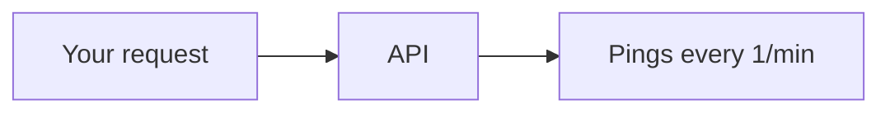

<i>Pings all of your [repl](https://replit.com) projects at once without you having to have the tab open.</i>

## Overview

### Setup Steps

Please select a method of setup below:

  
<strong>Sending a request via. Postman/Insomnia</strong>

   

> **Additional Note:**  
> When inputting the repl's url, you must include "https://"

<table>
  <tr>
    <td>Paste this into the URL bar:
     
  <pre><code>curl --location --request GET 'https://da.gd/init?host='</code></pre>

  Then fill in the "host" query. For each repl, you must create a new request.
  </td>
  </tr>
</table>

  
<strong>Sending a request via. Repl</strong>

   

> **Additional Note:**  
> When inputting the repl's url, you must include "https://"

<ol>
  <li>Import this repo into Repl</li>
  <li>Configure the `config.json` file with all the links you want to ping</li>
  <li>Click the run button at the top of your screen.</li>
  <li>Exit the repl.</li>
</ol>

  
<strong>Sending a request via. Discord Bot</strong>

  <kbd><a href="https://lqvers.netlify.app/invites/repl-always-on">Invite</a></kbd>
  <kbd><a href="https://github.com/lqvers/repl-always-on">Github Repository</a></kbd>

It's as easy as that! If you have any issues, please report it under the [Issues](https://github.com/ffrrancis/pingr/issues) tab.
